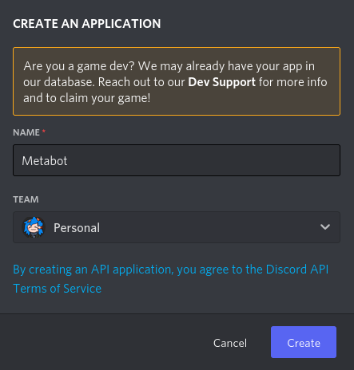
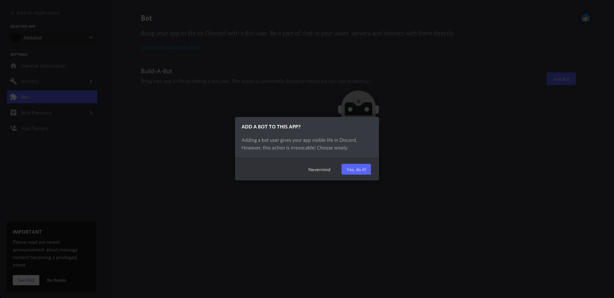
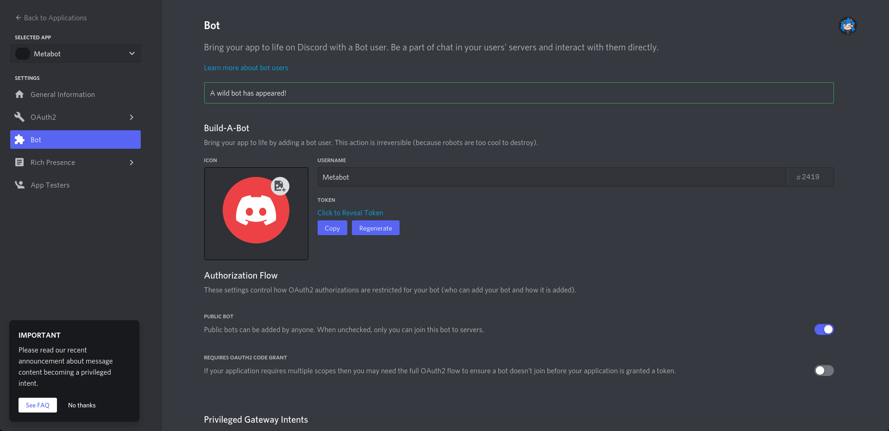

# Metabot

A small bot to extract metadata from files

## Prerequisites

exiftool (https://www.exiftool.org/) (must be in your PATH or in the same directory as the `metabot.py` file)

## Configure

Clone the repo with `git clone https://github.com/oyamabs/Metabot`

Go to https://discord.com/developers/applications and click on "New Application"

Click on "Bot" and on "Add Bot"

(you can add a profile picture and change your bot name if you want)

Then click on "Copy" to copy your bot Token and paste it in the `.env` file

Your `.env` should now look like this

Then go back to your bot web page and click on "OAuth2" and on "URL Generator"

Check "bot" and check "Send Messages".

Copy the link and paste it in your browser to invite your bot

And launch the bot `python3.8 metabot.py`